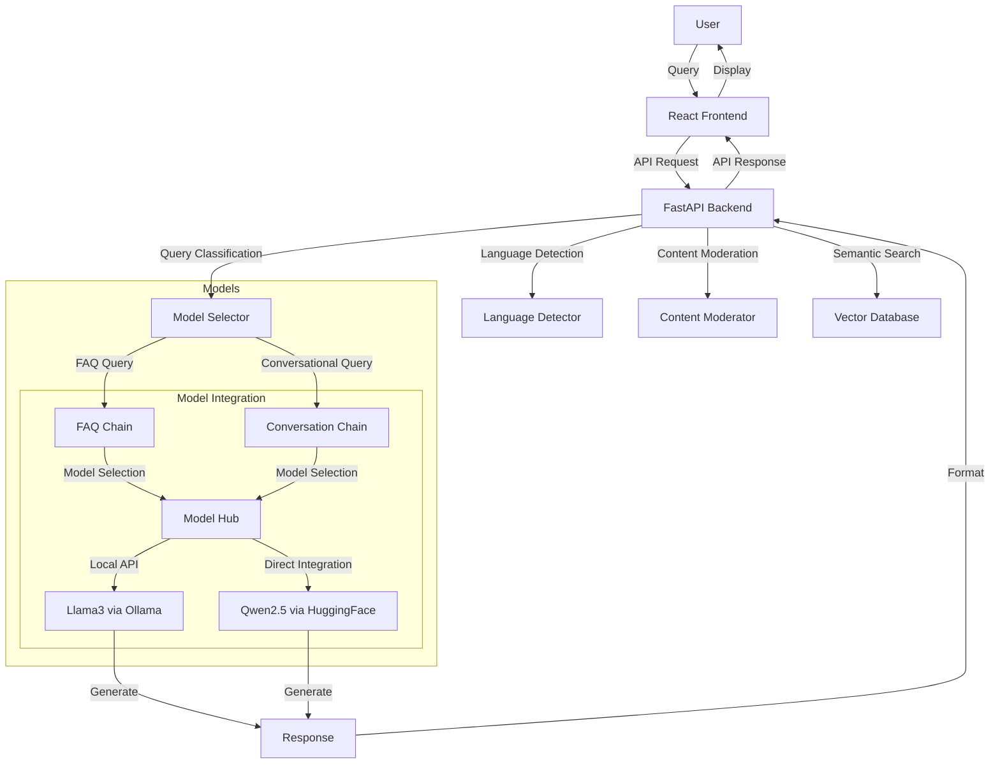
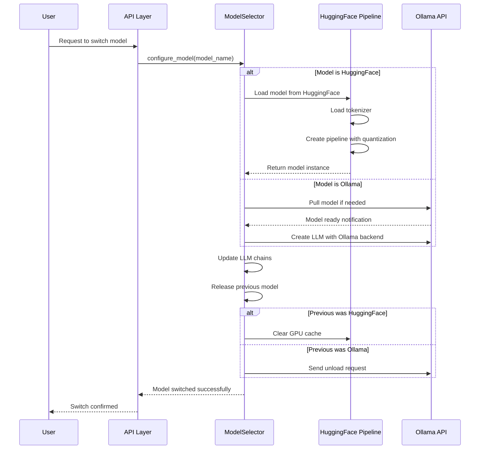
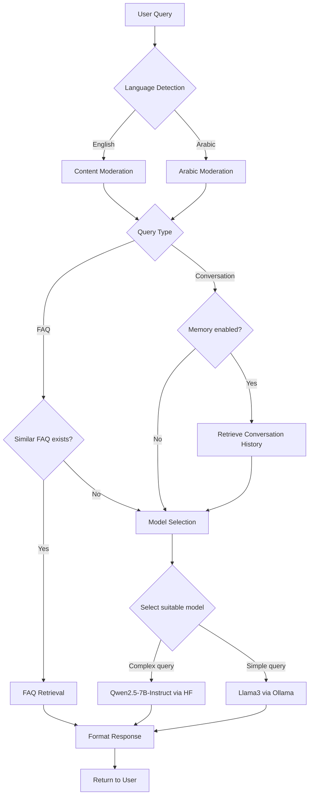

# Exodus Chatbot: Bilingual FAQ Chatbot with Hybrid Model Support

[](https://www.python.org/downloads/)
[](https://opensource.org/licenses/MIT)
[](https://github.com/psf/black)

A production-ready chatbot API that provides bilingual support for English and Arabic questions using semantic search and LLM-powered responses with a hybrid approach to model loading.

## 🌟 Features

- **Bilingual Support**: Handles both English and Arabic queries with dedicated optimization for each language
- **Content Moderation**: Built-in profanity and inappropriate content filtering for both languages
- **Automatic Language Detection**: Automatically detects the language of user input
- **Optimized Arabic Processing**: Specialized text processing for Arabic including diacritics handling and letter normalization
- **Semantic Search**: Uses sentence transformers to find the most relevant answers
- **Hybrid Model Approach**: 
  - Uses Ollama for Llama 3 model integration
  - Direct HuggingFace integration for Qwen2.5-7B-Instruct-AWQ model
- **Dynamic Model Switching**: Switch between models on-the-fly based on query needs
- **Graceful Degradation**: Falls back to simpler processing when advanced Arabic NLP tools aren't available

## System Architecture



## Arabic Language Support

This chatbot features comprehensive Arabic language capabilities:

- Language detection for Arabic text
- Arabic text preprocessing (diacritics removal, letter normalization)
- Arabic content moderation with custom profanity lists
- Optional AraBERT integration for advanced Arabic NLP when available
- Optimized similarity thresholds specific to Arabic text

For detailed information about Arabic support, see [ARABIC_SUPPORT.md](ARABIC_SUPPORT.md).

## 🚀 Quick Start

### Prerequisites

- Python 3.8 or higher (tested with Python 3.12)
- Ollama server with access to the Llama 3 model (`llama3:latest`)
- GPU with at least 8GB VRAM for HuggingFace models (recommended)
- Required Python packages (see requirements.txt)

### Installation

1. Clone the repository:
```bash
git clone https://github.com/yourusername/exodus-chatbot.git
cd exodus-chatbot
```

2. Create and activate a virtual environment (recommended):
```bash
python -m venv venv
source venv/bin/activate  # On Windows: venv\\Scripts\\activate
```

3. Install dependencies:
```bash
pip install -r requirements.txt
```

4. Run the server:
```bash
python main.py
```

## Model Configuration

The chatbot supports a hybrid approach to model loading:

### Ollama-based Models
- **Llama 3**: Accessed through the Ollama API
- Requires Ollama to be installed and running
- Lower resource usage as models are managed by Ollama

### HuggingFace-based Models
- **Qwen2.5-7B-Instruct**: Loaded directly from HuggingFace
- **Exodus-Arabic-Model**: Specialized bilingual model for English and Arabic
  - Optimized for FAQ and customer support scenarios
  - 4-bit AWQ quantization for efficient resource usage
  - Enhanced Arabic language understanding
- Requires more RAM/VRAM but offers better integration
- Optimized loading with dynamic precision selection

### Switching Between Models

Models can be switched through:
- The API endpoint: `POST /api/models/switch` with body `{"model_id": "model_name"}`
- The chat interface in the frontend
- Using the special command `/model model_name` in the chat

### Model Integration Comparison

| Feature | Ollama Integration | HuggingFace Direct Integration | Exodus-Arabic-Model |
|---------|-------------------|--------------------------------|-------------------|
| **Supported Models** | Llama3:latest | Qwen/Qwen2.5-7B-Instruct | yazeed-mshayekh/Exodus-Arabic-Model |
| **Resource Usage** | Lower (managed by Ollama) | Higher (loaded in application memory) | Optimized (4-bit AWQ) |
| **Setup Complexity** | Requires Ollama installation | No additional software needed | No additional software needed |
| **Response Speed** | Slightly slower (API calls) | Faster (direct integration) | Faster (direct integration) |
| **Customization** | Limited by Ollama API | Full control over model parameters | Full control over model parameters |
| **Quantization** | Managed by Ollama | Dynamic precision based on hardware | 4-bit AWQ quantization |
| **Memory Requirements** | ~2GB system RAM | ~8GB VRAM + ~4GB system RAM | ~4GB VRAM + ~2GB system RAM |
| **Error Handling** | API-level error handling | Direct exception handling | Direct exception handling |
| **Language Support** | Basic multilingual | Good multilingual | Optimized for English/Arabic |

The hybrid approach leverages the benefits of both integration methods:
- Ollama for ease of use and lower resource requirements
- HuggingFace for specialized models with direct integration and fine-tuned control

## Testing

To test the Arabic language capabilities:
```bash
python arabic_test.py
```

This test verifies:
- Arabic language detection
- Profanity filtering for Arabic text
- Arabic text preprocessing functionality
- Basic Arabic string handling

## Environment Variables

- `ENABLE_ARABIC`: Enable Arabic language support (default: true)
- `SIMILARITY_THRESHOLD_AR`: Similarity threshold for Arabic queries (default: 0.3)
- `SIMILARITY_THRESHOLD_EN`: Similarity threshold for English queries (default: 0.4)
- `OLLAMA_BASE_URL`: URL for the Ollama service (default: http://localhost:11434)
- `MODEL_NAME`: LLM model to use (default: llama3:latest)

## Frontend Configuration

The chatbot includes a React-based frontend that communicates with the backend API:

### Setup

1. Install frontend dependencies:
```bash
cd frontend
npm install
```

2. Start the development server:
```bash
npm run dev
```

3. Access the UI at http://localhost:3000

### Configuration Settings

The frontend is configured to connect to the backend API via:

- Direct API calls to `http://localhost:8000/api` (configured in `frontend/src/api/chatService.js`)
- Development proxy from `/api` to `http://localhost:8000` (configured in `frontend/vite.config.js`)

If you change the backend port, make sure to update both these configuration files.

## Troubleshooting

### CUDA/Model Initialization Issues

If you encounter an error like:
```
Error in find_most_similar_faq: Cannot re-initialize CUDA in forked subprocess. To use CUDA with multiprocessing, you must use the 'spawn' start method
```

This is caused by PyTorch trying to use CUDA in a forked subprocess. To fix this:

1. Make sure you're running with a single worker:
   ```bash
   # The app now defaults to one worker, but you can force it:
   python main.py
   ```

2. If the issue persists, modify multiprocessing settings:
   ```python
   # This is now included in main.py:
   import multiprocessing
   multiprocessing.set_start_method('spawn', force=True)
   ```

3. Or set these environment variables before running:
   ```bash
   export CUDA_VISIBLE_DEVICES=""  # Disables CUDA
   export TOKENIZERS_PARALLELISM=false  # Disables parallel tokenization
   python main.py
   ```

4. For Python 3.12 users:
   If SSL-related errors occur, try replacing openssl-python with pyOpenSSL:
   ```bash
   pip uninstall openssl-python
   pip install pyOpenSSL
   ```

### HuggingFace Model Loading Issues

If you encounter issues loading the HuggingFace models:

1. **Out of memory**: Try reducing batch size or using a smaller model
   ```bash
   export PYTORCH_CUDA_ALLOC_CONF=max_split_size_mb:128
   ```

2. **Truncation warnings**: These are now fixed in the code but if they reappear:
   ```python
   pipeline = transformers.pipeline(..., truncation=True)
   ```

3. **No GPU detected**: Check CUDA installation
   ```bash
   python -c "import torch; print(torch.cuda.is_available(), torch.cuda.device_count())"
   ```

### Frontend API Connection Issues

If the frontend cannot connect to the API:

1. Verify the backend server is running at the expected port (default: 8000)
2. Check the API URL in `frontend/src/api/chatService.js` 
3. Ensure the proxy configuration in `frontend/vite.config.js` matches the backend port
4. Check for CORS errors in the browser console and verify CORS is properly enabled in the backend

## Documentation

- [ARABIC_SUPPORT.md](ARABIC_SUPPORT.md): Detailed information about Arabic language support
- API documentation is available at `/api/docs` when the server is running

## 📝 Contributing

Contributions are welcome! Please feel free to submit a Pull Request. For major changes, please open an issue first to discuss what you would like to change.

1. Fork the repository
2. Create your feature branch (`git checkout -b feature/AmazingFeature`)
3. Commit your changes (`git commit -m 'Add some AmazingFeature'`)
4. Push to the branch (`git push origin feature/AmazingFeature`)
5. Open a Pull Request

## 📄 License

This project is licensed under the MIT License - see the [LICENSE](LICENSE) file for details.

## 🙏 Acknowledgments

- Thanks to the Ollama team for their excellent model serving solution
- Thanks to the HuggingFace team for their transformers library
- Thanks to all contributors who have helped with code, suggestions, and bug reports

## 📧 Contact

For questions and support, please open an issue in the GitHub repository.

## Model Loading Process

The hybrid model approach follows this process when loading and switching between models:



This process ensures efficient resource management by properly unloading previous models before loading new ones. The implementation handles both HuggingFace models (loaded directly in the application process) and Ollama models (managed by the external Ollama service).

## Model Selection Flow

The chatbot uses a sophisticated model selection process to route queries to the appropriate model based on query type and context:



This process ensures that:
1. Queries are properly preprocessed based on language
2. Similar FAQs are efficiently retrieved when available
3. The appropriate model is selected based on query complexity
4. All responses are properly formatted before returning to the user